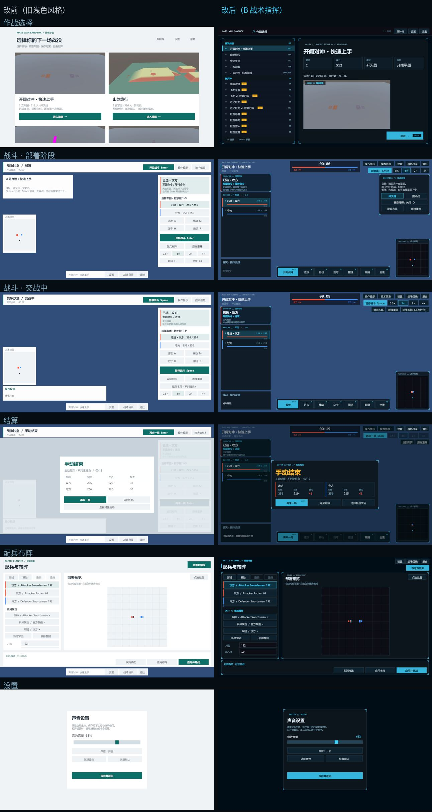
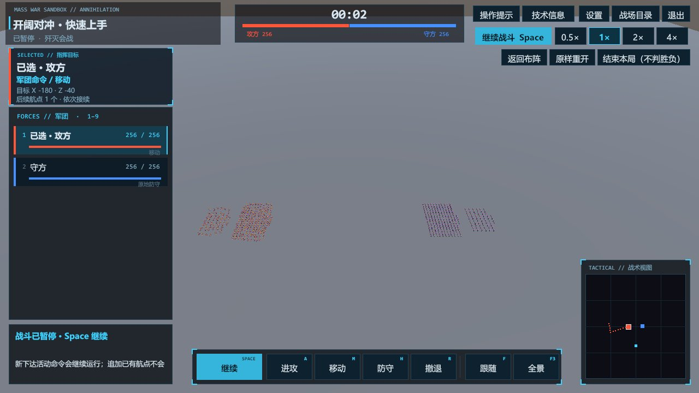
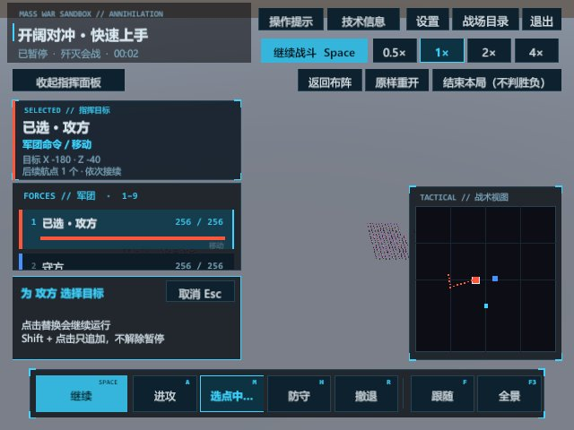

# 运行时 UI 统一为 B「战术指挥」风格（2026-10-01）

> 完成者：**Arena.ai Agent Mode**（AI 智能体）。Agent Mode 会调度多种大模型（如 Claude、ChatGPT、Gemini、Grok、Qwen、Kimi 等），本次具体用的是哪个底层模型无法确认，也不能披露。需求与决策来自用户。

## 1. 起因

用户反馈运行时仍能看到旧的浅色风格。排查结果：只有兵种库和兵种属性面板用了 B 配色，主菜单、战场卡片、设置、确认框、部署页、战斗指挥 HUD、结算、地形原型都还是旧的浅色主题（青绿 #106F67 + 白卡片）。

用户的决定：
- **全部界面统一**，包括地形原型（M61/M62）；
- **允许按 B 设计稿调整布局**，但按钮和功能必须一一对应。

## 2. 对比

真实试玩包截图（`Builds/OfficialRoster-20261001-06`，可读性冒烟自动截取）：

| 1280×720 战斗中（已暂停、有航点） | 640×480 小窗（正在选目标点） |
|---|---|
|  |  |

> 编辑器截图测试（`WarSandboxUiStyleCaptureTests`）拍不到 GPU 实例化绘制的 3D 战场，所以对比图里战斗页的背景是蓝底；真实试玩包里是正常地面。

## 3. 改动

### 3.1 共享主题 `WarSandboxUGUI`
- 原有颜色名（Background、Surface、Ink、Muted、Accent、Soft、Line、Danger）保留，取值改为 B 配色。没有单独写颜色的界面会自动跟着换。
- 新增颜色：Amber、Purple、Raised、FieldFill、Dim、Deep、Bar、Shade。
- 默认面板和按钮加 1px 描边；按钮常态 0.86 亮度，悬停时变亮；主按钮是青底深色字。
- 新增元素：
  - `Brackets`：青色角标；
  - `Code`：等宽代码字，如 `OP-01 // ANNIHILATION`；
  - `Chip`：NEW 标签、快捷键标签；
  - `ScrollIntoView`：键盘选择时，列表自动滚动到选中项。
- `WarSandboxStatTheme`（属性面板配色）改为引用共享主题，全局只剩一套色板。

### 3.2 作战选择页（B1）
- 左侧是分组列表：首发战役 / 新兵种（带 NEW 标签）/ 自由编成，每行显示序号、名称、兵力。
- 右侧是选中战场的详情：
  - 代号行；
  - 标题；
  - 4 个统计格：军团、兵力、模式、地形；
  - 简介；
  - 2 万人以上显示负载提示；
  - 战场预览；
  - 「部署 › ENTER」按钮。
- 统计格的数据从目录描述 `N 支军团 · X 人 · 模式\n简介` 解析出来，不额外编造数据；解析失败时原样显示描述。
- 顶栏：兵种库 / 设置 / 退出。
- 设置、退出确认、加载中、加载失败也都换成 B 卡片。

### 3.3 战斗指挥 HUD（B2）
- **左上**：战场标题（下面加了深色底板，浅色地面上也能看清）、阶段与模式。
- **顶部居中**（宽屏）：计时器加分段兵力条；据点模式时下方显示据点状态。
- **左栏**：
  - 选中军团卡，滚动军团列表时它位置不变；
  - 军团列表，每张卡显示人数、血条和当前命令；
  - 底部是战况与操作反馈面板。
- **底部命令栏**：开始/暂停/继续/再来一局（主按钮）、进攻 A、移动 M、防守 H、撤退 R、跟随 F、全景 F3。
- **右上**：
  - 第一行：操作提示、技术信息，加上系统条（设置 / 战场目录 / 退出，原来在屏幕底部）；
  - 第二行：顶部的开始/暂停按钮和 4 档速度；
  - 第三行（战斗中和结束后）：返回布阵、原样重开、结束本局。
- **部署阶段右侧**是「作战准备」卡：简报、歼灭战/据点战、静态障碍、配兵布阵、原样重开。
- **右下**：战术小地图。
- **窄屏（宽度 < 900）**：
  - 计时器移到副标题里；
  - 保留「收起/展开指挥面板」；
  - 反馈面板移到命令栏上方；
  - 空间不够时隐藏小地图（和以前一样）。

### 3.4 结算（B3）
- 结构：AFTER-ACTION 代号、大标题（未分胜负时为琥珀色）、原因与用时。
- 军团格子每行 2 个，超出时可滚动；胜方显示 WIN 标签。
- 按钮：再来一局（ENTER）/ 返回布阵 / 选择其他战场。

### 3.5 部署页、方案库、属性面板
- 部署页和方案库：标题改成 B 代码行，卡片加角标，地图换深色底和琥珀色据点。
- 系统条移到右上后，「本地方案库」按钮下移到它下方。原来底部导航占的 62px 也空了出来，部署页和属性面板都改成占满全高；属性面板的卡片从系统条下方开始。

### 3.6 地形原型（M61/M62）
- 4 行 IMGUI 说明文字不变，改成 B 配色：深色底、描边、角标、等宽标题。
- 世界标记（据点圈）改用 B 琥珀色。

## 4. 按钮一一对应

所有按钮 id 和回调都没变，只调整了位置和样式：

| 功能 | id | 旧位置 | 新位置 |
|---|---|---|---|
| 开始/暂停/继续/再来一局 | `battle-toggle` | 顶栏 | 右上第二行 |
| 同上（主按钮） | `start` | 右栏 | 底部命令栏最前 |
| 进攻/移动/防守/撤退 | `attack` `move` `hold` `retreat` | 右栏 | 底部命令栏 |
| 跟随/全景 | `follow` `panorama` | 右栏 | 底部命令栏 |
| 4 档速度 | `speed-0..3` | 右栏 | 右上第二行 |
| 配兵布阵/返回布阵、原样重开 | `edit` `reset` | 右栏 | 部署阶段在作战准备卡，其余阶段在右上第三行 |
| 结束本局 | `end-battle` | 右栏 | 右上第三行 |
| 歼灭战/据点战/静态障碍 | `annihilation` `point` `obstacles` | 右栏 | 作战准备卡 |
| 选择军团 | `army-i` | 右栏 | 左栏军团列表 |
| 取消选点 | `move-cancel` | 反馈面板 | 反馈面板 |
| 操作提示/技术信息 | `battle-help` `battle-debug` | 顶栏 | 右上第一行 |
| 收起/展开指挥面板（窄屏） | `orders-toggle` | 右上 | 左上 |
| 设置/战场目录/退出 | `nav-*` | 底部导航条 | 右上系统条 |
| 进入战场 | `card-i-enter` | 每张卡片一个 | 先点列表行 `card-i` 选中，再点唯一的「部署」按钮 `card-<选中>-enter` |
| 结算三按钮 | `result-*` | 结算卡 | 结算卡 |

需要说明的地方：
- 底部导航条上的战场名标签 `nav-name` 去掉了，战场名现在显示在 HUD 左上的标题里。
- 作战选择页新增了 **↑↓ 选择、Enter 部署** 的快捷键，这是 B1 设计稿里的交互；鼠标操作的功能没有增减。
- 计时器、兵力条只是把已有信息集中显示，不是新功能。

## 5. 冒烟脚本同步

目录页改成「先选中、再部署」后，3 个冒烟脚本都在点 `card-i-enter` 之前加了一步点 `card-i`：
- `WarSandboxTerrainCycle.Official.cs`
- `WarSandboxTerrainCycle.Presets.cs`
- `WarSandboxModelTrialSmoke.cs`

Readability 和 Playability 脚本不用改，它们引用的 id 都保留了。

## 6. 验证

| 项目 | 结果 |
|---|---|
| EditMode 全量 | **479/481**：新增 19 项全部通过；失败的 2 项是已知的 EditorBuildSettings 问题，用户已决定不处理 |
| 新增 `WarSandboxUiStyleTests`（EditMode） | 19/19：描述解析、分组、正式目录 21 条描述全部能解析且分组连续、系统条位置与布局一致 |
| PlayMode 全量 | **14/21**：新增截图测试通过；失败的 7 项是已知的 `WarSandboxSceneEntryTests` 问题 |
| 属性面板 PlayMode | 通过 |
| 截图测试 `CaptureEveryRuntimeScreen` | 15 个界面，改前 `Logs/UiStyle/shots-1001-165255`，改后 `Logs/UiStyle/shots-1001-170942` |
| 试玩包冒烟 official-catalog（-06） | 通过：21 个战场全部经由新目录页进入 |
| 试玩包冒烟 readability（-06） | 通过：49 项检查，1280×720 和 640×480 都覆盖文字放置与指针可达性 |
| 试玩包冒烟 playability-seed（-06） | 通过 |

试玩包：
- **`Builds/OfficialRoster-20261001-06`**：最终版本；
- `-05`：缺少标题底板，保留不覆盖；
- 内容和 Version03 一致（21 个战场）。

## 7. 已知限制

- Presets、ModelTrial 两个冒烟脚本已经同步修改，但它们针对的目录不在这个试玩包里，这次没有运行。
- `DeploymentHUD` 里的 `DrawLegacyEditor` / `DrawPlanLibrary`，以及 `CommandHUD` 里的 `DrawLegacyControls` / `DrawControlPointStatus`，都是运行时不会调用的旧 IMGUI 代码，没有改。
- 世界标记仍然用 IMGUI 绘制，这次只改了颜色。
